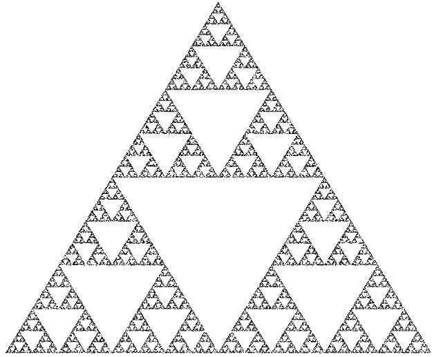

# Programming in R
## Homework Task I -- git and GitHub

This is your first homework task. Since it will not be graded there is no deadline. Nevertheless, we strongly encourage you to try out this task, both to get to know the homework task format and to get to know git. All the following tasks will assume that you know how to use `git` and *GitHub*.

## Information Material

* [Slides]()
* Recommended resources
  * **[Software Carpentry Git Course](https://swcarpentry.github.io/git-novice/)**: A very good and thorough first `git` course that teaches how to use `git` from the command line. It is strongly recommended that you know the command line `git`, since you will understand what is going on under the hood even when using other tools. Expected reading time: 3 hours.
  * **[Happy Git with R](https://happygitwithr.com/index.html)**: A course of `git`, *GitHub*, and *RStudio*. This will teach you how to use all your tools together efficiently. 
* Additional resources
  * **[Git Immersion](http://gitimmersion.com/index.html)**: Similar to the "*Software Carpentry Git Course*" but with less explanation.
  * **[Git and GitHub](http://r-pkgs.had.co.nz/git.html)** by Hadley Wickham: A quick intro on how to use `git`, *GitHub*, and *RStudio* that is shorter than "*Happy Git with R*" above and may be for you if you are a quick learner.
  * **[GitHub Introduction](https://guides.github.com/activities/hello-world/)**: Get to know the *GitHub* web interface
  * **Cheat Sheets** are an excellent way to keep a reference around and to look up commands you may have forgot. The big `git` companies all offer one (and GitHub isn't necessarily the best): [GitHub](https://github.github.com/training-kit/downloads/github-git-cheat-sheet.pdf), [GitLab](https://about.gitlab.com/images/press/git-cheat-sheet.pdf), [Atlassian](https://www.atlassian.com/git/tutorials/atlassian-git-cheatsheet). Look at all of them and see if you find them useful.
  
## The Task

This is a project that was set up by different characters, who submitted their work to different branches. However, in the current state their individual contributions are in different branches and have not yet been brought together. Your task is to find out who created what part of the work, and to combine their efforts to get a working project.

You will very likely not be able to do this unless you read a good part of at least one of the sources. Your reward will be that you find out how `git` works *now*, while you don't have to stress about deadlines.

### Setup
1. "`fork`" this repository to your own GitHub Account
2. "`clone`" your own fork to your laptop

### Inspection
3. Look at the different branches present in the repository. How do they relate? (Hint: `git branch --all` is useful here. The "History" button in RStudio's "Git" pane may also be useful: try to show "(all branches)".)
4. What branch / what character was working on which function?

### Merging
5. Combine all the different branches into the master branch. You will get at least one "merge conflict", which you have to resolve intelligently: consider which of the conflicting edits is more "valuable". Note that you should not blindly merge all branches you find, because some branches are "parents" of other branches.

### After You Merge
6. Can you find out what part of the resulting code was created by what character? You could browse commits in *GitHub*, you could use *GitHub*'s "blame" function, and you can use `git blame`. Get familiar with all of them.

### Rendering
7. You whould now be able to load `sierpinski.Rmd` in your RStudio session and render it, getting a nice animation. Your result should look like this:

  